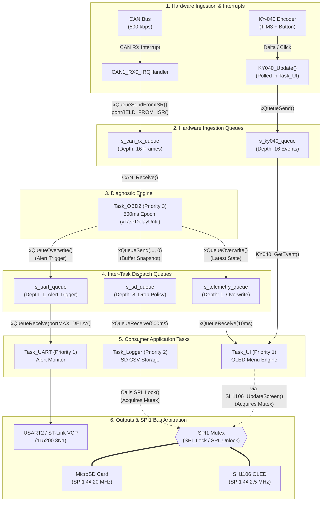

# CAN OBD-II Diagnostic Scanner & Real-Time Data Logger

An LL / RTOS diagnostic scanner and high-speed telemetry logger built for the **STM32L476RG (ARM Cortex-M4 80 MHz)** microcontroller. 

The system implements the physical and network layers of **ISO 11898-2 (High-Speed CAN 500 kbps)**, the transport layer **ISO 15765-2 (ISO-TP)** with multi-frame flow control reassembly, and the application diagnostics layer **SAE J1979 / ISO 15765-4 (OBD-II)**. It features an interactive **1.3" SH1106 OLED** graphical menu driven by a **hardware quadrature rotary encoder (TIM3)**, asynchronous event-based UART alerting, and high-reliability CSV blackbox logging to **MicroSD (FatFs)** over a mutex-arbitrated SPI bus.

---

## Project Structure

The project follows a clean, modular embedded architecture separating hardware drivers, board support, protocol stacks, and RTOS presentation tasks:

```
obd2-scanner/
├── Bsp/                        # Board Support Package (STM32L476RG low-layer peripherals)
│   ├── Inc/                    # Header files for hardware peripherals
│   │   ├── can.h               # bxCAN initialization, frame structs, filter configs
│   │   ├── clk.h               # PLL clock tree (80 MHz) & SysTick monotonic timer
│   │   ├── gpio.h              # Chip-select & push-button input configuration
│   │   ├── rtc.h               # Real-Time Clock interface & calendar structs
│   │   ├── spi.h               # SPI1 master driver, baudrate switching & mutex lock
│   │   ├── tim.h               # TIM3 hardware quadrature encoder decoder
│   │   └── uart.h              # USART2 115200 baud serial driver (ring buffer + ISR)
│   └── Src/                    # Implementation of LL hardware peripheral drivers
├── Components/                 # Drivers for external hardware modules
│   ├── KY-040/                 # Rotary encoder state machine and event queue
│   ├── MicroSD/                # Physical SD SPI driver (CMD0..CMD58, ACMD41)
│   └── SH1106/                 # 1.3" OLED display driver (128x64 buffer, font engine)
├── Config/                     # FreeRTOS operating system configuration
│   └── FreeRTOSConfig.h        # Preemption, tick rate, heap size, priorities, hooks
├── Core/                       # Application core & automotive protocol engine
│   ├── Inc/                    # Protocol definitions and system declarations
│   │   ├── main.h              # Global system definitions and includes
│   │   ├── obd2.h              # SAE J1979 PIDs, services, DTC parsing, descriptors
│   │   ├── obd_multiframe.h    # ISO-TP (ISO 15765-2) multi-frame context & types
│   │   └── logger.h            # CSV data snapshot structs and FatFs interface
│   └── Src/                    # Core implementation
│       ├── main.c              # System boot, hardware setup, task instantiation
│       ├── obd2.c              # OBD-II query engine, sensor formulas, DTC decoding, Mode 06
│       ├── obd_multiframe.c    # ISO-TP state machine (SF, FF, FC, CF handling)
│       └── logger.c            # File operations, header generation, flash sync
├── Tasks/                      # FreeRTOS application threads & graphical views
│   ├── Inc/                    # Task headers & UI common descriptor interface
│   │   ├── task_obd2.h         # Diagnostics sweep task (500 ms cycle)
│   │   ├── task_logger.h       # Background SD card file writing task
│   │   ├── task_ui.h           # OLED presentation & user interaction task
│   │   ├── task_uart.h         # Asynchronous diagnostic error reporting task
│   │   └── ui_common.h         # Screen Descriptor Table interface & common drawing
│   └── Src/                    # Task implementations
│       ├── task_obd2.c         # CAN query loop, bitmask scanner, queue dispatcher
│       ├── task_logger.c       # Decoupled SD write queue processor
│       ├── task_uart.c         # State change & active trouble code monitor
│       ├── task_ui.c           # Master UI engine & encoder event dispatcher
│       └── ui/                 # Modular OLED screen implementations
│           ├── ui_view_live.c      # View 1: Service 01 Live Sensor Telemetry
│           ├── ui_view_dtc.c       # Views 2 & 3: Trouble Codes & Clear DTC
│           ├── ui_view_info.c      # Views 4, 6, 7: Freeze Frame, VIN, Protocol Info
│           ├── ui_view_mode06.c    # View 5: Service 06 On-Board Monitoring Tests
│           └── ui_view_settings.c  # Views 8, 9, 10: SD Interval, Channels, RTC
├── Drivers/                    # STMicroelectronics Low-Layer (LL) Driver Library
│   ├── CMSIS/                  # ARM Cortex-M4 core headers
│   └── STM32L4xx_LL_Driver/    # Register-level drivers (CAN, SPI, TIM, USART, PWR...)
├── Middlewares/                # Third-party middleware
│   ├── FatFs/                  # ChaN FatFs lightweight filesystem module
│   └── FreeRTOS/               # FreeRTOS v10 Kernel (ARM Cortex-M4F port)
├── Linker/                     # GNU LD linker script
│   └── STM32L476RGTx_FLASH.ld  # Flash (1 MB) and SRAM1+SRAM2 (128 KB) memory map
├── Cmake/                      # CMake toolchain files
│   └── arm-none-eabi-gcc.cmake # Cross-compilation flags for ARM GCC
├── CMakeLists.txt              # Root build configuration
└── README.md                   # Project documentation
```

---

## OBD-II Services Implemented & Accessible via OLED

The scanner implements 7 standard SAE J1979 / ISO 15765-4 diagnostic service modes directly queryable and viewable from the OLED screen:

| OBD-II Service | Standard Title | Screen in Menu | Description & Implementation Details |
| :--- | :--- | :--- | :--- |
| **Service 01** | Show Current Data | `1. LIVE DATA` | Sweeps active sensor parameters (Engine RPM, Speed, MAF, Coolant, Load, Throttle, Fuel Pressure, MAP, Intake Temp, Timing Advance, Fuel Trims, Voltage, Oil Temp). Includes bitmask auto-discovery (PIDs 0x00, 0x20, 0x40). |
| **Service 02** | Show Freeze Frame Data | `4. FREEZE FRAME` | Queries engine telemetry captured at the exact moment a diagnostic fault was triggered (Engine RPM, Vehicle Speed, Coolant Temp). |
| **Service 03** | Show Stored Diagnostic Trouble Codes | `2. TROUBLE CODES DTC` | Retrieves confirmed, emission-related fault codes stored in ECU memory (Pxxxx, Cxxxx, Bxxxx, Uxxxx) with human-readable SAE descriptions. |
| **Service 04** | Clear Diagnostic Trouble Codes & Reset MIL | `3. CLEAR CODES` | Issues a clear command to the ECU to wipe all diagnostic fault codes, freeze frames, and extinguish the Check Engine / MIL lamp with a YES/NO confirmation safety prompt. |
| **Service 06** | Request On-Board Monitoring Test Results | `5. ON-BOARD MON. 06` | Reads self-diagnostic monitor test results for components like Oxygen Sensors (MIDs 0x01, 0x02), Catalytic Converters (MID 0x21), EGR/VVT (MID 0x31), EVAP (MID 0x39), and Cylinder Misfire Counters (MIDs 0xA2-0xA5). Evaluates measured value against minimum and maximum thresholds and marks test as `[PASS]` or `[FAIL]`. Clicking a monitor displays a dedicated detail inspector. |
| **Service 07** | Show Pending Diagnostic Trouble Codes | `2. TROUBLE CODES DTC` | Retrieves unconfirmed fault codes detected during the current or previous drive cycle before the MIL lamp is officially illuminated. |
| **Service 09** | Request Vehicle Information | `6. VEHICLE INFO VIN` | Interrogates PID 0x02 to retrieve the full 17-character Vehicle Identification Number (VIN) reassembled through the multi-frame ISO-TP transport layer. |
| **Service 0A** | Show Permanent Diagnostic Trouble Codes | `2. TROUBLE CODES DTC` | Reads permanent DTCs that cannot be erased via Service 04 and are only cleared automatically by the vehicle ECU once the underlying fault is verified as repaired over several driving cycles. |

---

## Technical Deep-Dive: How It Works & Why It Was Designed This Way

### 1. CAN Controller vs. CAN Transceiver
- **CAN Controller (`bxCAN` inside STM32L476RG)**:
  - This is the **digital logic engine** (OSI Layer 2 - Data Link Layer).
  - It contains all programmable registers (`CAN1->MCR`, `CAN1->BTR`, `CAN1->sTxMailBox`).
  - It handles framing (Identifier, DLC, Payload), bus arbitration (resolving dominant vs. recessive bits without data destruction), CRC generation and verification (15-bit polynomial), automatic bit stuffing, ACK bit checking, and hardware acceptance filtering.
  - It outputs two 3.3V digital CMOS logic signals: **`CAN_TX` (PA12)** and **`CAN_RX` (PA11)**.
- **CAN Transceiver (e.g., SN65HVD230)**:
  - This is a **purely analog hardware component** (OSI Layer 1 - Physical Layer).
  - It has **no firmware, no registers, no CPU, and no SPI/I2C communication interface**. It cannot be programmed.
  - Its sole purpose is **voltage level translation and differential driving**:
    - When STM32 drives `CAN_TX` LOW (dominant bit `0`), the transceiver drives `CAN_H` to ~3.5V and `CAN_L` to ~1.5V (V_diff approx 2.0V).
    - When STM32 drives `CAN_TX` HIGH (recessive bit `1`), the transceiver leaves both lines at ~2.5V (V_diff approx 0V).
    - An analog comparator on the transceiver converts differential voltages from the vehicle bus back into a 3.3V logic signal on `CAN_RX`.
  - In addition, the transceiver provides electrostatic discharge (ESD) protection up to +/- 16 kV and protects the delicate 3.3V microcontroller silicon from electrical spikes.

---

### 2. High-Speed CAN Bus Architecture (500 kbps Configuration)
* **Bit Timing Calculation (500 kbps @ 80 MHz PCLK1)**:
  Operating from an 80 MHz APB1 peripheral clock, the prescaler is set to BRP = 10, yielding a nominal time quantum t_q = 10 / 80 MHz = 125 ns. A single bit consists of 16 time quanta (16 * 125 ns = 2 us -> 500 kbps):
  - Sync = 1 * t_q
  - Time Segment 1 (TS1) = 13 * t_q
  - Time Segment 2 (TS2) = 2 * t_q

  *Why this configuration?* This yields a sample point at **87.5%**, strictly complying with **ISO 11898-2** and **CiA 301** recommendations. Placing the sample point at 87.5% provides maximum tolerance against line reflections and propagation delays in long vehicle wiring harnesses.
* **Hardware Filter Bank Filtering**:
  Rather than waking the CPU for every unrelated message broadcast on the car's interior bus (e.g. ABS, door modules, instrument cluster), filter bank 0 is set up in 32-bit Identifier Mask Mode:
  - Base ID: `0x7E8` (Primary ECU response address)
  - Mask: `0x7F8` (Matches IDs `0x7E8` through `0x7EF`)
  *Why this configuration?* Standard functional OBD-II broadcast requests are sent to `0x7DF`. ECUs respond on individual physical addresses from `0x7E8` to `0x7EF`. The `0x7F8` mask allows the STM32 hardware filter to discard 100% of non-diagnostic vehicle traffic in silicon, freeing the Cortex-M4 CPU from handling unnecessary interrupts.
* **Interrupt Service Routine (ISR) to FreeRTOS Queue Offloading**:
  The `CAN1_RX0_IRQHandler` simply pops the frame from hardware FIFO 0 and pushes it into a 16-element FreeRTOS queue (`s_can_rx_queue`) using `xQueueSendFromISR()` alongside `portYIELD_FROM_ISR(xHigherPriorityTaskWoken)`. 
  *Why this configuration?* The ISR completes in under 2 us. Immediate context switching awakens `Task_OBD2` without waiting for the next SysTick slice. Protocol validation, payload decoding, and timeouts are entirely deferred to thread context, preventing interrupt starvation.

---

### 3. OBD-II Protocol Implementation (SAE J1979 / ISO 15765-4)
* **Request-Response Flow**:
  Diagnostic requests are transmitted as ISO-TP Single Frames (SF) containing data length, service mode byte, and parameter ID (PID). ECUs acknowledge positive requests by echoing the requested service mode with bit 6 set (`service + 0x40`), e.g., query `0x01` yields response `0x41`.
* **Dynamic PID Discovery via Bitmasks**:
  Instead of blindly polling every sensor (which causes ECUs to reply with Negative Response Codes 0x7F / 0x12 or introduce 100 ms timeouts), the system first queries the standard 32-bit capability masks:
  - PID `0x00`: Supported PIDs in range `0x01`–`0x20`
  - PID `0x20`: Supported PIDs in range `0x21`–`0x40`
  - PID `0x40`: Supported PIDs in range `0x41`–`0x60`
  *Why this configuration?* By dynamically querying these masks, the live sweep loop skips unsupported sensors automatically. A full sweep cycle drops from multiple seconds down to **300–500 ms**. Essential safety PIDs (RPM, Speed, Coolant, Load, Throttle, MAF) are kept active by default.
* **Diagnostic Trouble Code (DTC) Bit-Field Decoding (SAE J2012 / ISO 15031-6)**:
  ECUs return DTC fault records as packed 16-bit words (`Byte A` and `Byte B`). The scanner decodes each 16-bit integer into standard 5-character alphanumeric codes (`OBD2_FormatDTC`) strictly following SAE J2012:
  - **Bits [15:14] (System Category Prefix)**:
    - `00` -> **P** (Powertrain: engine, transmission, emissions)
    - `01` -> **C** (Chassis: ABS, ESP, steering, suspension)
    - `10` -> **B** (Body: airbags, climate control, lighting)
    - `11` -> **U** (Network: CAN bus communication, ECU timeouts)
  - **Bits [13:12] (Code Type / Standard)**:
    - `00` -> `0` (Standard SAE / ISO generic code)
    - `01` -> `1` (Manufacturer-specific code)
    - `10` -> `2` (SAE generic code)
    - `11` -> `3` (SAE reserved / manufacturer specific)
  - **Bits [11:8], [7:4], [3:0] (Subsystems & Fault Identifier)**:
    - Three consecutive 4-bit hexadecimal nibbles (e.g., raw word `0x0300` -> string `P0300` Random/Multiple Cylinder Misfire).
  
  Empty padding slots (`0x0000`) are automatically ignored during ISO-TP reassembly, and valid decoded codes are matched against an internal flash dictionary to display human-readable fault descriptions directly on the OLED.

---

### 4. ISO-TP Multi-Frame Protocol (ISO 15765-2 Transport Layer)
* **The Problem**:
  Classic CAN frames are capped at **8 data bytes**. Diagnostic payloads like a 17-character VIN or an extended list of diagnostic trouble codes cannot fit into a single CAN frame.
* **The Solution**:
  The system implements a full ISO-TP state machine in [`obd_multiframe.c`](Core/Src/obd_multiframe.c):
  1. **First Frame (FF)**: The ECU announces a multi-frame payload by transmitting `0x10` followed by the 12-bit total byte length.
  2. **Flow Control (FC)**: The scanner immediately replies with an FC frame specifying `FS = 0` (ContinueToSend), `BS = 0` (Block Size = full stream without pauses), and `STmin = 0` (Separation Time = no delay required).
  3. **Consecutive Frames (CF)**: The ECU transmits consecutive chunks labeled with a rolling Sequence Number (`0x21`..`0x2F`).
  4. The scanner reassembles and validates the full payload before passing it to the decoder.

---

### 5. FreeRTOS Multitasking, IPC & Concurrency Architecture

The operating system runs **FreeRTOS v10** with preemption enabled, a 1 ms tick rate (`configTICK_RATE_HZ = 1000`), and Heap 4 memory management (`configTOTAL_HEAP_SIZE = 32768` bytes). The firmware strictly isolates diagnostic polling, file I/O, graphical presentation, and serial alerting across 4 independent threads.

#### A. FreeRTOS Task Architecture

| Task Name | Priority | Stack Size | Scheduling & Periodicity | Sleep / Blocking Mechanism | Role & Design Rationale |
| :--- | :--- | :--- | :--- | :--- | :--- |
| **`Task_OBD2`** | 3 (`IDLE + 3`) | 768 words (3072 B) | Periodic (500 ms sweep epoch) | `vTaskDelayUntil(&xLastWakeTime, 500)` | Highest application priority to guarantee precise, deterministic CAN bus polling. |
| **`Task_Logger`**| 2 (`IDLE + 2`) | 768 words (3072 B) | Event / Queue driven | `xQueueReceive(s_sd_queue, ..., 500)` | Decoupled background task writing CSV logs to SD flash. Isolated to absorb NAND write latency. |
| **`Task_UI`** | 1 (`IDLE + 1`) | 768 words (3072 B) | Event & Periodic (~12.5 FPS) | `vTaskDelay(10)` encoder poll / 80 ms refresh | Renders OLED screens and dispatches encoder navigation events. Non-blocking snapshot reception. |
| **`Task_UART`** | 1 (`IDLE + 1`) | 384 words (1536 B) | Event-driven (Alert only) | `xQueueReceive(s_uart_queue, ..., portMAX_DELAY)` | Blocks indefinitely until a telemetry snapshot arrives; reports link status changes and DTCs. Zero CPU overhead when idle. |

#### B. Inter-Process Communication (IPC) & Queue Topology

Communication between hardware ISRs and software tasks relies entirely on 5 dedicated FreeRTOS queues:

| Queue Handle | Item Type | Depth | Producer | Consumer | Policy / Design Pattern |
| :--- | :--- | :---: | :--- | :--- | :--- |
| **`s_can_rx_queue`** | `CAN_Frame_t` (16 B) | 16 | `CAN1_RX0_IRQHandler` | `Task_OBD2` (`CAN_Receive`) | **Hardware Decoupling**: ISR pushes incoming frames via `xQueueSendFromISR` with `portYIELD_FROM_ISR()`. Absorbs CAN bus bursts up to 16 frames. |
| **`s_telemetry_queue`**| `VehicleData_t` | 1 | `Task_OBD2` (`xQueueOverwrite`) | `Task_UI` (`xQueueReceive`) | **Single-Slot Overwrite**: Task_OBD2 overwrites the newest vehicle state. UI always displays the freshest telemetry without queue buffering delay. |
| **`s_uart_queue`** | `VehicleData_t` | 1 | `Task_OBD2` (`xQueueOverwrite`) | `Task_UART` (`xQueueReceive`) | **Single-Slot Overwrite**: Wakes Task_UART from `portMAX_DELAY` to evaluate DTC changes and link connectivity. |
| **`s_sd_queue`** | `LogSnapshot_t` | 8 | `Task_OBD2` (`Task_Logger_EnqueueSnapshot`) | `Task_Logger` (`xQueueReceive`) | **Non-Blocking Drop**: Snapshot is enqueued with timeout 0 (`xQueueSend(..., 0)`). If SD write latency temporarily stalls the queue, new rows are dropped to preserve CAN real-time constraints. |
| **`s_ky040_queue`** | `KY040_Event_t` | 16 | `KY040_Update()` (TIM3 delta) | `Task_UI` (`KY040_GetEvent`) | **Navigation Buffer**: Buffers encoder rotation detents (CW/CCW) and button clicks/holds so fast rotational gestures are never lost. |

#### C. System Dataflow & IPC Diagram



> [!NOTE]
> **Implementation Architecture Details**:
> - **`KY040_Update()` Execution Context**: While logically serving as the producer for `s_ky040_queue`, `KY040_Update()` is polled synchronously at the start of each iteration in [`Task_UI`](Tasks/Src/task_ui.c#L146) to evaluate TIM3 hardware counter deltas without consuming interrupt resources. The resulting rotation and button events are buffered in `s_ky040_queue` and consumed immediately by `KY040_GetEvent()`.
> - **Shared SPI Mutex Encapsulation**: In `Task_Logger`, bus locking is invoked explicitly in the task loop ([`task_logger.c`](Tasks/Src/task_logger.c#L42)). In `Task_UI`, `SPI_Lock()` and prescaler reconfiguration are encapsulated internally within the low-level graphics library call [`SH1106_UpdateScreen()`](Components/SH1106/sh1106.c#L105). Both tasks enforce the identical mutual exclusion guarantee on the physical `SPI1` bus.

#### D. Temporal Determinism via `vTaskDelayUntil`
Standard RTOS delay `vTaskDelay(500)` pauses execution for 500 ms *after* task processing finishes (T_period = 500 ms + T_exec). Because OBD-II query durations fluctuate depending on ECU response latencies and ISO-TP multi-frame reassembly time, `vTaskDelay` would induce severe timing jitter and cumulative clock drift.

`Task_OBD2` utilizes `vTaskDelayUntil(&xLastWakeTime, pdMS_TO_TICKS(500))`. This calculates the remaining sleep duration dynamically (T_sleep = 500 ms - T_exec), guaranteeing an exact, drift-free 500 ms sweep epoch regardless of CAN bus traffic variations.

#### E. Shared SPI1 Bus Mutex Arbitration
Both the SH1106 OLED display and the MicroSD card share physical bus `SPI1` (SCK: PA5, MISO: PA6, MOSI: PA7), but require different Chip-Select pins and different baudrates (OLED runs at 2.5 MHz / `DIV32`, SD card streams at 20 MHz / `DIV4`).
A FreeRTOS mutex (`SPI_Lock` / `SPI_Unlock`) arbitrates bus ownership. Whenever `Task_UI` or `Task_Logger` needs to communicate, it acquires the mutex, dynamically changes the prescaler register (`LL_SPI_SetBaudRatePrescaler`), asserts its respective CS line, performs the transaction, and releases the mutex. This completely prevents bus collisions and filesystem corruption.

#### F. Memory Safety, Interrupt Correlation & Fault Hooks
- **Zero Runtime Heap Allocation**: All task stacks, queues, and mutexes are created during initial system startup. The runtime operational loop contains zero calls to `pvPortMalloc()` or `malloc()`, guaranteeing absolute immunity to memory fragmentation during continuous operation.
- **NVIC Interrupt Priority Correlation**:
  ARM Cortex-M4 implements 4 bits of preemption priority (16 priority levels, 0 = highest, 15 = lowest).
  - FreeRTOS kernel syscall threshold: `configMAX_SYSCALL_INTERRUPT_PRIORITY = 5`
  - Peripheral interrupts invoking FreeRTOS API (`CAN1_RX0_IRQHandler`, `USART2_IRQHandler`): Assigned to **NVIC Priority 6**
  Because Priority 6 is logically lower than Priority 5, peripheral interrupts are safely masked during FreeRTOS critical sections, preventing internal queue state corruption.
- **Diagnostic System Hooks**:
  - `vApplicationStackOverflowHook`: Traps tasks exceeding their allocated stack watermark (`configCHECK_FOR_STACK_OVERFLOW = 2`), broadcasts an emergency UART trace identifying the faulty task name, and halts the system safely.
  - `vApplicationMallocFailedHook`: Triggers an emergency UART alert if startup heap allocation exceeds the 32 KB threshold.

#### G. MicroSD Fault Resilience & Automatic Remount Loop
Hot-unplugging a memory card or encountering a flash block write error can stall conventional embedded loggers. `Task_Logger` implements a non-blocking, self-healing recovery loop:
- **Card Loss Detection**: If `Logger_IsReady()` returns false (due to physical card ejection or a FatFs `FR_DISK_ERR`), the task immediately transitions into an unmounted safe state.
- **Queue Drain & Non-Blocking Drop**: Incoming telemetry rows sent to `s_sd_queue` are safely discarded with zero wait (`xQueueSend(..., 0)`), preventing RAM exhaustion and ensuring the CAN diagnostic engine and UI tasks never stall.
- **1-Second Remount Polling**: While in offline state, `Task_Logger` periodically re-attempts `Logger_TryMount()` every 1000 ms (`pdMS_TO_TICKS(1000)`) under SPI mutex arbitration. Once a valid FAT32 card is re-inserted, the filesystem is remounted, a new CSV session header is generated, and logging resumes automatically.

---

### 6. Hardware Quadrature Encoder with Digital Filtering (TIM3)
Mechanical rotary encoders (such as KY-040) generate heavy contact chatter (*switch bounce*). Servicing these transitions using software GPIO pin interrupts (`EXTI`) causes CPU interrupt storms and dropped steps.

The signals are connected to **TIM3** running in hardware **Encoder Interface Mode X2 on TI1** (`LL_TIM_ENCODERMODE_X2_TI1`). In addition, an 8-clock digital input capture filter (`LL_TIM_IC_FILTER_FDIV1_N8`) is enabled on channels CH1 and CH2. The timer silicon counts position bidirectionally and ignores any pulses shorter than 8 core clock cycles, eliminating 100% of contact bounce without consuming CPU cycles.

Position changes and push-button transitions are decoded by `KY040_Update()` and pushed into a dedicated 16-element FreeRTOS event queue (`s_ky040_queue`), fully decoupling hardware sampling from the UI rendering thread.

---

### 7. Clock Tree (80 MHz) & Hardware RTC with LSE -> LSI Fallback

The system clocking and timekeeping architecture in [`clk.c`](Bsp/Src/clk.c) and [`rtc.c`](Bsp/Src/rtc.c) prioritizes maximum Cortex-M4 computational throughput and bulletproof real-time calendar reliability:

* **80 MHz Core Performance & Flash Acceleration**:
  - **PLL Configuration**: The internal 16 MHz high-speed oscillator (HSI16) is scaled via the main PLL (`PLLM = 1` -> 16 MHz VCO in, `PLLN = 10` -> 160 MHz VCO out, `PLLR = 2` -> **80 MHz SYSCLK**).
  - **Flash Latency (4 Wait States)**: Embedded flash memory cannot run directly at 80 MHz. The controller sets `LL_FLASH_LATENCY_4` (4 wait states) before the frequency transition.
  - **Zero-Wait ART Accelerator**: Instruction Cache (`LL_FLASH_EnableInstCache`), Data Cache (`LL_FLASH_EnableDataCache`), and Prefetch Buffer (`LL_FLASH_EnablePrefetch`) are enabled, executing code from flash at full 80 MHz throughput with 0-wait-state equivalent performance (100 DMIPS).
  - **Bus Clock Distribution**: AHB, APB1, and APB2 prescalers are configured to DIV1, clocking the CAN controller (`PCLK1 = 80 MHz`) and SPI bus (`PCLK2 = 80 MHz`) at maximum speed.
  - **NVIC Grouping**: Configured to 4 bits of preemption priority (`NVIC_PRIORITYGROUP_4`), strictly satisfying FreeRTOS Cortex-M port requirements.

* **Hardware RTC Redundancy (LSE -> LSI Fallback)**:
  - **Primary Clock Source**: The driver attempts to start the external 32.768 kHz quartz crystal (LSE) on the Nucleo-64 board for maximum calendar accuracy.
  - **Automatic Fallback on Failure**: If the LSE fails to oscillate or times out (due to an unpopulated crystal, mechanical shock, or track damage), the driver smoothly falls back to the internal 32 kHz RC oscillator (LSI).
  - **Dynamic Prescaler Recalculation**:
    - **LSE Mode (32.768 kHz)**: Configures `AsynchPrescaler = 127`, `SynchPrescaler = 255` -> `32768 / ((127 + 1) * (255 + 1)) = 1 Hz`.
    - **LSI Mode (~32.000 kHz)**: Dynamically adjusts `AsynchPrescaler = 127`, `SynchPrescaler = 249` -> `32000 / ((127 + 1) * (249 + 1)) = 1 Hz`.
    This guarantees accurate 1-second calendar ticking regardless of external crystal availability.

* **Automatic Preprocessor Build-Time Timestamp Initialization**:
  - When backup domain power is lost (e.g. no coin cell connected to VBAT), the RTC initializes its calendar using the preprocessor macros `__DATE__` and `__TIME__` parsed at compile time.
  - This ensures all generated CSV log files have valid, non-zero timestamps corresponding to the firmware build date rather than epoch zero (2000-01-01).

---

### 8. Low-Layer (LL) instead of HAL
Instead of the standard STM32 HAL library, the entire project is constructed using **STM32 Low-Layer (LL)** drivers, due to a desire to fully understand how the hardware works:
- **Footprint**: Compiled binary size is only **~86 KB Flash** and **~40 KB RAM** (including FreeRTOS and FatFs).
- **Determinism**: LL drivers provide direct, inline register operations without nested handles, layers of callbacks, or hidden spinlocks.

---

## Hardware Pinout & Wiring Guide

| Subsystem / Function | STM32L476RG Pin | External Module Pin | Electrical Mode / Alternate Function |
| :--- | :--- | :--- | :--- |
| **CAN RX** | **PA11** | SN65HVD230 `CRX` | AF9 (CAN1_RX), Internal Pull-Up |
| **CAN TX** | **PA12** | SN65HVD230 `CTX` | AF9 (CAN1_TX), Push-Pull, High-Speed |
| **SPI1 SCK** | **PA5** | OLED `SCK` & SD `SCK` | AF5 (SPI1_SCK), High-Speed |
| **SPI1 MISO** | **PA6** | MicroSD `MISO / DO` | AF5 (SPI1_MISO), Pull-Up |
| **SPI1 MOSI** | **PA7** | OLED `MOSI` & SD `MOSI`| AF5 (SPI1_MOSI), Push-Pull, High-Speed |
| **SD Card CS** | **PA4** | MicroSD `CS` | GPIO Output Push-Pull, Active LOW |
| **OLED CS** | **PB6** | SH1106 `CS` | GPIO Output Push-Pull, Active LOW |
| **OLED DC** | **PC7** | SH1106 `DC` | GPIO Output Push-Pull (Data=1, Cmd=0) |
| **OLED RES** | **PA9** | SH1106 `RES` | GPIO Output Push-Pull, Active LOW Reset |
| **Encoder A (CLK)** | **PB4** | KY-040 `CLK` | AF2 (TIM3_CH1), Pull-Up, N8 Filter |
| **Encoder B (DT)** | **PB5** | KY-040 `DT` | AF2 (TIM3_CH2), Pull-Up, N8 Filter |
| **Encoder SW (BTN)**| **PA10** | KY-040 `SW` | GPIO Input, Internal Pull-Up, Active LOW |
| **USART2 TX** | **PA2** | ST-Link VCP (USB) | AF7 (USART2_TX), 115200 Baud 8N1 |
| **USART2 RX** | **PA3** | ST-Link VCP (USB) | AF7 (USART2_RX), 115200 Baud 8N1 |

### Power Supply Considerations

- **Development / Bench Testing Mode**:
  The system is powered directly from a laptop or PC host via the onboard ST-Link USB connector (5V VBUS stepped down by the onboard regulator to 3.3V). This also provides serial debug telemetry and diagnostic alerts over the Virtual COM Port (USART2).
- **Standalone In-Vehicle Operation**:
  In a standalone vehicle installation, the scanner can draw power directly from the standard OBD-II port:
  - **Pin 16**: Battery Constant Positive (+12V to +14.4V DC)
  - **Pin 4 / Pin 5**: Chassis / Signal Ground (GND)

  To power the board safely and reliably without thermal issues, an **external DC-DC step-down (buck) converter** (stepping down from vehicle 12V/14.4V to a clean 5V) can be connected from OBD-II Pin 16/4 into the Nucleo's 5V input rail. Stepping down 14V linearly through the board's onboard LDO is not recommended due to heat dissipation.

### Bench Testing & Hardware-in-the-Loop (HIL) Verification

For safe, repeatable bench testing and protocol validation without requiring immediate access to a physical vehicle, the scanner was developed and verified against a dedicated custom hardware simulator:
- **[basic-obd2-simulator](https://github.com/KarolKks/basic-obd2-simulator)**: An basic OBD-II ECU simulator developed by the author on an ESP32-S3 microcontroller with an SN65HVD230 CAN transceiver. It features an embedded Wi-Fi web dashboard allowing real-time adjustment of:
  - **Service 01 (Live Telemetry)**: Dynamic polling of Engine RPM, Vehicle Speed, Coolant Temp, Calculated Load, MAF airflow, and Throttle Position.
  - **Service 03 (Stored DTCs)**: Dynamic injection of fault codes (P0300, P0171, P0420, P0500) over Single Frame and multi-frame ISO-TP.
  - **Service 04 (Clear DTCs)**: Clearing trouble codes and turning off the Check Engine (MIL) lamp with standard 0x44 acknowledgment.
  - **Service 09 (Vehicle Info)**: Transmitting 17-character VIN (`1HGBH41JXMN109186`), CALID, and ECU Name across multi-frame ISO-TP.

*(Note: Extended diagnostic modes such as Service 02 Freeze Frame and Service 06 On-Board Monitors are implemented on the scanner side; when tested against this simulator, the scanner's timeout and non-response detection logic is safely validated).*

---

## User Interface & Menu System

The OLED interface is built on a **Screen Descriptor Table** architecture containing 10 diagnostic screens:

1. **`1. LIVE DATA`**: Real-time sensor readout (RPM, Speed, Coolant, Load, Throttle, MAF...) with vertical scrolling (Service 01).
2. **`2. TROUBLE CODES DTC`**: Diagnostic fault code viewer grouping Stored (03), Pending (07), and Permanent (0A) codes with SAE descriptions.
3. **`3. CLEAR CODES`**: Service 04 diagnostic trouble code eraser and MIL lamp reset with confirmation dialog.
4. **`4. FREEZE FRAME`**: Service 02 snapshot data captured by the vehicle ECU at the moment a fault occurred.
5. **`5. ON-BOARD MON. 06`**: Service 06 on-board monitor test results with pass/fail evaluation and detailed parameter view.
6. **`6. VEHICLE INFO VIN`**: Displays the 17-character VIN reassembled via multi-frame ISO-TP (Service 09).
7. **`7. PROTOCOL & MODULE`**: Information on protocol (ISO 15765-4), baudrate (500k), and hardware status.
8. **`8. SD LOG INTERVAL`**: Configures CSV telemetry logging frequency (OFF, 1s through 60s).
9. **`9. SD LOG CHANNELS`**: Allows toggling which PIDs from service 01 are saved into each CSV row.
10. **`10. SET DATE & TIME`**: Interactive RTC calendar editor (Year, Month, Day, Hour, Minute) saved into STM32 hardware RTC registers.

**Encoder Controls**:
- **Rotate**: Move cursor in menu / scroll sensor list / modify value in edit mode.
- **Click**: Enter view / toggle option / inspect monitor details / confirm selection.
- **Long Press**: Exit current subview and return to the main menu.

---

## Building the Project

### Prerequisites
- **Toolchain**: `arm-none-eabi-gcc`
- **Build System**: `CMake` (>= 3.20) and `Ninja`

### Build Command

```bash
# Configure build with ARM GCC toolchain
cmake -B build -G Ninja -DCMAKE_TOOLCHAIN_FILE=Cmake/arm-none-eabi-gcc.cmake

# Compile the firmware
cmake --build build
```

This generates the following binaries in the `build/` folder:
- `can-data-logger.bin` (Raw binary)
- `can-data-logger.hex` (Intel HEX file)
- `can-data-logger.elf` (ELF image with debugging symbols)

---

## Flashing the Microcontroller

### 1. Drag & Drop via ST-Link Virtual Drive (Default & Fastest Method)
When connecting the **STM32L476RG Nucleo-64** board to your computer via USB, the onboard ST-Link enumerates as a USB Mass Storage drive (e.g., named **`NODE_L476RG`** in Windows Explorer / macOS Finder / Linux file manager).

1. Build the project to generate `build/can-data-logger.bin`.
2. Simply **copy/drag and drop `can-data-logger.bin` directly onto the `NODE_L476RG` drive**.
3. The ST-Link LED will flash rapidly between green and red while writing to flash memory. Once it stops, the microcontroller resets and boots the scanner firmware automatically.

### 2. Flashing via STM32CubeIDE
If you prefer official ST development tools:
- **STM32CubeIDE**: Import the project as an existing CMake / Makefile project, create a Run/Debug configuration targeting the ST-Link GDB server, and click **Run**.

---

